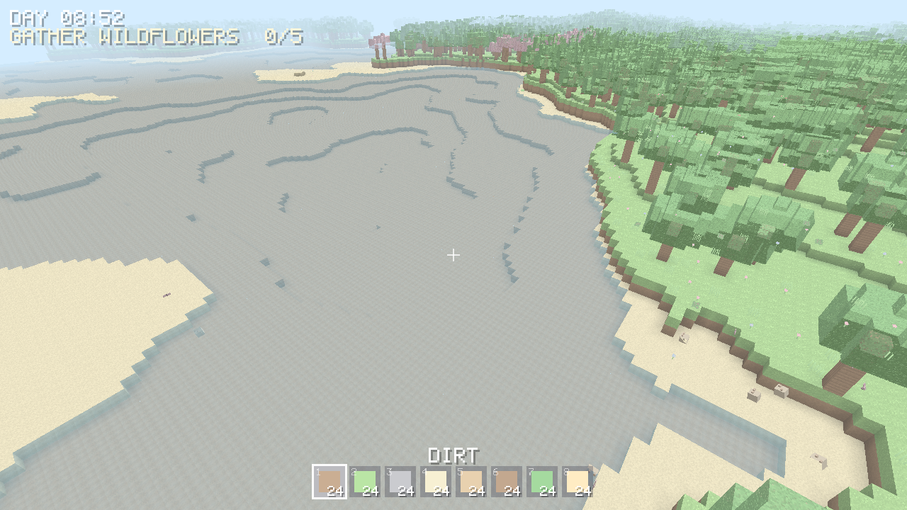

# 🐈 PixelCraft

A cosy, cute, performance-focused **3D voxel game** with infinite world
generation, written in Rust. You play as a sentient cat exploring pastel
meadows, sandy shores and snowy peaks — mining, collecting and building.



## Architecture

A custom voxel engine, split into focused crates so the simulation is fully
testable without a GPU:

| Crate | Responsibility |
|-------|----------------|
| `pixelcraft-core` | Coordinate math, block registry, **palette-compressed** chunk storage, sparse world. |
| `pixelcraft-worldgen` | Seedable Perlin/fBm noise, Whittaker biomes, deterministic infinite terrain + caves + decoration. |
| `pixelcraft-mesh` | **Greedy meshing** (merges coplanar faces), opaque/transparent layers, face culling. |
| `pixelcraft-physics` | AABB swept voxel collision, cat character controller (gravity, jump, coyote-time). |
| `pixelcraft-game` | Streaming, raycasting, camera/frustum, inventory, interaction, and the `wgpu` renderer. |

### Performance highlights

- **Palette-compressed chunks**: uniform chunks (pure air/stone) use *zero*
  per-voxel memory; a streamed world of ~2000 chunks fits in ~7 MiB instead of
  ~140 MiB naive.
- **Greedy meshing**: a flat 32×32 surface becomes one quad, not 1024.
- **Threaded streaming**: terrain generates on a worker pool with per-frame
  budgets for smooth frame pacing; chunks unload with hysteresis.
- **Frustum culling** of chunk meshes; aggressive release-profile LTO.

## Running

```bash
# Windowed game (needs a GPU + display):
cargo run --release --bin pixelcraft --features render -- [seed]

# Headless self-checking simulation (no display):
cargo run --release

# Headless screenshots (software Vulkan / lavapipe):
cargo run --bin screenshot --features capture -- [seed] [out_dir]
```

Controls: **WASD** move, **Space** jump, **Shift** sprint, **mouse** look,
**left-click** mine, **right-click** place, **1–8 / scroll** select block,
**E** talk to a cat, **F5 / F9** save / load.

## Features

Infinite deterministic terrain with 6 biomes (meadow, forest, cherry grove,
beach, snowy peaks, dunes), cosy cottages, ore-bearing caves, biome-aware trees
(oak / cherry blossom / pine); greedy meshing with ambient occlusion and
procedural block textures; a day/night cycle with a gradient sky, sun/moon,
stars and drifting clouds; animated water and swaying grass; glowing lanterns
and crystals; ambient critters, butterflies, fireflies and chatty cat NPCs;
cherry-petal and mining particles; a cosy quest chain; a HUD with crosshair,
hotbar, clock and dialogue; and save/load that persists edits across the
streamed world.

## Testing

```bash
cargo test          # ~80 headless unit tests across all crates
```
